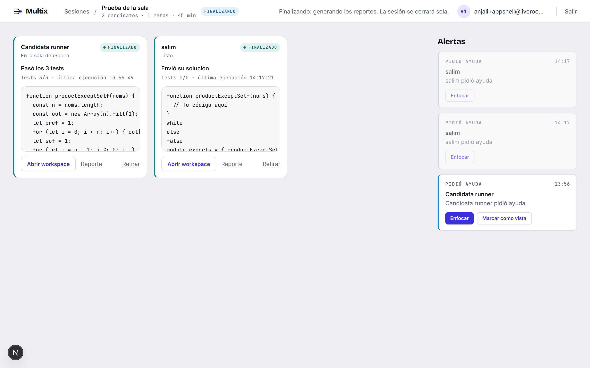
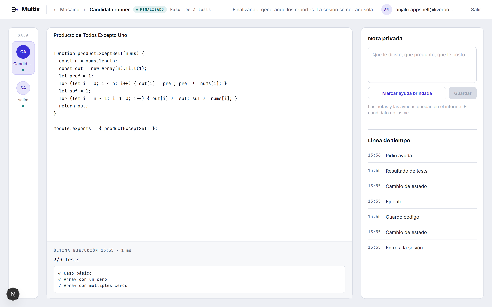
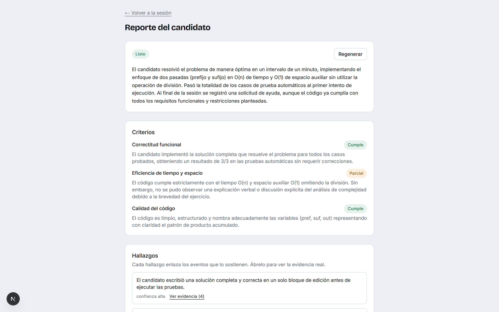
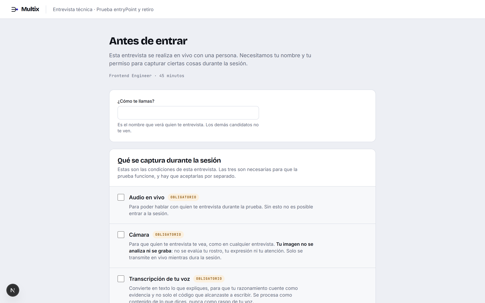

# Multix

**Entrevistas técnicas en vivo, con hasta tres candidatos a la vez y un informe
que puede probar lo que afirma.**

---

Una entrevista técnica con tres candidatos en paralelo es, en la práctica,
imposible de observar. Mientras lees el código de uno, los otros dos avanzan
—o se atascan— sin que nadie lo vea. Al final quedan tres impresiones vagas y
la sensación de que la decisión se tomó con la mitad de la información.

Multix mira lo que tú no puedes mirar y te lo dice en palabras.

## Qué hace

### Te dice qué está pasando, no un color

Cada candidato tiene una tarjeta con su código actualizándose mientras escribe.
Debajo, en texto:

> **Atascado** — Sin actividad hace 94 s
> **Avanza** — Pasó de 2/6 a 4/6 tests
> **Atascado** — Mismo error en 3 ejecuciones seguidas: `TypeError: out[day] is undefined`

Un semáforo amarillo obliga a interpretar. Una frase te dice si vale la pena
interrumpir, y qué preguntar cuando lo hagas.



*El mosaico: el código de cada candidato en vivo, su estado con la razón debajo, y las alertas a la derecha.*

### Te avisa cuando alguien te necesita

Si un candidato lleva minuto y medio sin tocar nada, si repite el mismo error, o
si levanta la mano, aparece una alerta con su nombre y el motivo. Un clic y
tienes su pantalla completa delante: el código entero, la última ejecución, qué
tests pasó y cuáles no.



*Un candidato a fondo. A la derecha, tu cuaderno privado y todo lo que ha hecho, minuto a minuto.*

### Prepara el reto por ti, pero no lo publica solo

Describes qué quieres evaluar —"manipulación de arreglos y casos borde, nivel
mid"— y la IA redacta el enunciado, el código inicial y la batería de pruebas,
incluidas las que el candidato no ve. Tú lo revisas, lo ajustas y decides cuándo
publicarlo. Hasta ese momento, ningún candidato ve nada.

### Redacta el informe y enseña las pruebas

Al cerrar la sesión, cada candidato recibe un análisis: resumen, criterios
evaluados, hallazgos, preguntas de seguimiento para la siguiente ronda.

Lo que lo distingue: **cada hallazgo se puede abrir y ver el momento exacto que
lo sostiene** — la ejecución concreta, con su hora y su resultado. Nada de
afirmaciones sin respaldo.



*El informe: criterios evaluados, hallazgos y la evidencia detrás de cada uno.*

## Por qué puedes fiarte del informe

**Dice lo que no pudo ver.** Todos los informes incluyen sus propios límites.
Uno real, de una sesión de prueba:

> *Eficiencia de tiempo y espacio — **Parcial**. El código cumple con la
> complejidad O(n) y espacio auxiliar O(1). Sin embargo, no se pudo observar una
> explicación verbal ni discusión del análisis de complejidad.*

No infló un "cumple" con lo que no observó. Lo marcó parcial y explicó por qué.

**Un hallazgo sin pruebas se marca como tal.** Si la IA no puede enlazar
evidencia, el hallazgo aparece con confianza baja, a la vista.

**La IA no decide.** Propone y organiza; la decisión de avanzar, esperar o
descartar la registra una persona, con su nombre, la hora y su comentario.
Queda auditada.

**No infiere personalidad.** Clasifica actividad observable —escribió, ejecutó,
pasó tests, se detuvo—, no rasgos ni estados de ánimo.

## Para el candidato

Entra con un enlace. **Sin crear cuenta, sin instalar nada.** Antes de entrar ve
una por una las condiciones —audio, cámara y transcripción— con qué hace cada
una y por qué hace falta, y las acepta por separado.

Sobre la cámara, la promesa es explícita: **su imagen no se analiza ni se
graba.** No se evalúa su rostro, su expresión ni su atención. Solo se transmite
en vivo mientras dura la sesión, como en cualquier entrevista.



*Lo que ve el candidato antes de entrar: cada condición, qué hace y por qué hace falta.*

Cada uno trabaja en su propio espacio: no ve a los demás candidatos, ni ellos a
él. Tiene el enunciado a un lado y un editor de verdad al otro, con resaltado de
sintaxis. Ejecuta sus pruebas cuando quiere y ve qué pasó. Si se traba, hay un
botón para pedir ayuda sin tener que interrumpir en voz alta.

Su código se ejecuta en su propio navegador y nunca se comparte con los demás.

## Cómo es una sesión

**Antes** — Creas la sesión, generas el reto, lo revisas y lo publicas. Compartes
un enlace.

**Durante** — Los candidatos entran, comprueban su cámara y su micrófono, y
esperan. Arrancas cuando estén los tres. A partir de ahí ves el mosaico: código
en vivo, estado con su motivo, alertas, y a cada uno en vídeo.

Cuando alguien te preocupa, abres su workspace: su código completo, su última
ejecución, la línea de tiempo de lo que ha hecho, y un cuaderno privado donde
anotas lo que te llamó la atención o dejas constancia de la ayuda que le diste.
El candidato no ve esas notas; el informe sí las tiene en cuenta.

**Después** — Cierras y los informes se generan solos. Los lees, abres la
evidencia de lo que te llame la atención, y registras tu decisión.

---

## Para desarrolladores

**Next.js 16 (App Router) + Convex + Tailwind 4 + Monaco.**

Convex cubre base de datos, tiempo real y funciones de servidor a la vez. No hay
REST, ni WebSockets propios, ni estado global de cliente: `useQuery` se
resuscribe solo cuando el dato cambia. Por eso **no hay un solo `setInterval` en
el repositorio** — si aparece uno, algo se entendió mal.

El código del candidato corre **en su navegador**, en un Web Worker que se
detiene a los 5 segundos si no termina. Convex guarda el resultado como
evidencia; nunca ejecuta código ajeno.

### Arrancar

```bash
pnpm install
pnpm dev
```

Hace falta un `.env` en la raíz con la URL del deployment compartido; el valor
está en [docs/SETUP.md](docs/SETUP.md). No necesitas cuenta de Convex.

> **Solo Salim corre `npx convex dev`** (o `pnpm dev:backend`). Ese comando
> publica el backend en el deployment compartido: si lo corre alguien más,
> sobrescribe las funciones con su copia local.

### Verlo funcionando

Necesitas dos ventanas: un segundo navegador o un perfil aparte para el
candidato, no basta con otra pestaña.

1. Regístrate en `/signin` y crea una sesión.
2. Genera un reto con IA, revísalo y pulsa **Publicar**.
3. Abre el enlace `/join/<código>` en la otra ventana y entra como candidato.
4. Desde el panel, **Habilitar el link** e **Iniciar sesión**. La ventana del
   candidato salta sola a su sala.
5. Escribe una solución y pulsa **Ejecutar**.

Con las dos ventanas a la vista se ve lo que importa: el código aparece en el
mosaico mientras se escribe, sin recargar nada. Prueba **Pedir ayuda**, o quédate
quieto minuto y medio y espera la alerta.

### Estructura

| Ruta | Contenido | Dueño |
|---|---|---|
| `app/` | Rutas y pantallas | Anjali |
| `components/candidate/`, `components/interviewer/` | Pantallas por rol | Anjali |
| `components/ui/` | Sistema de diseño | Gael |
| `lib/runner/` | Ejecución en el navegador (Web Worker) | Anjali |
| `convex/` | Schema, queries, mutations, actions, cron | Salim |
| `convex/ai/` | Generación de retos y evaluación | Alejandro |
| `design/`, `multix-design-system.md` | Mockups y tokens | Gael |
| `proxy.ts` | Rutas protegidas (Next 16 lo llama `proxy`, no `middleware`) | Anjali |

### Documentación

| Documento | Para qué |
|---|---|
| [docs/SETUP.md](docs/SETUP.md) | **Empieza aquí.** Clonar, variables, correr, reglas del equipo |
| [docs/api-contract.md](docs/api-contract.md) | Qué función alimenta cada pantalla, y el contrato de los retos |
| [docs/frontend.md](docs/frontend.md) | Plan del frontend, rama por rama |
| [docs/PROGRESS.md](docs/PROGRESS.md) | Avance de cada quien y bitácora |

Ramas: `main` (estable) ← `develop` (integración) ← `feature/*`, `fix/*`.
Nadie commitea directo a `main`.

### Decisiones que conviene no re-litigar

- **Los candidatos no tienen cuenta.** Entran con un `joinToken` que viaja en
  cada llamada. El aislamiento se valida en el servidor, nunca escondiendo cosas
  en la interfaz.
- **El autosave va con debounce de 400 ms**, jamás una mutation por tecla.
- **Las pruebas técnicas son solo en JavaScript.** Sin runtime de Python,
  generarlas en Python produce retos que nadie puede ejecutar.
- **El reto declara qué función invoca el runner** (`entryPoint`). No se deduce
  leyendo el código con una expresión regular: un cambio de prompt lo rompería
  en silencio.
- **Los tres consentimientos —audio, cámara y transcripción— son obligatorios**
  y se aceptan por separado, con la explicación de qué hace cada uno delante.
- **Todo hallazgo enlaza evidencia real** o se marca con confianza baja.

### Estado actual

Funciona de principio a fin: registro, preparación del reto, ingreso de
candidatos, sesión en vivo, ejecución de pruebas, alertas, informe con evidencia
y decisión registrada.

Audio y vídeo en vivo funcionan con LiveKit, y el entrevistador puede tomar
notas privadas y dejar constancia de la ayuda que dio.

El límite conocido: la ejecución del código ocurre en el navegador del
candidato. Es suficiente para una demo y evita mandar código ajeno al servidor,
pero una versión de producción lo movería a un sandbox aislado del lado del
servidor.
